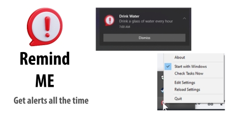

# Remind Me - User Guide

**Version 1.1.0** | Windows Task Reminder Application

## What is Remind Me?

Remind Me is a "Never Miss a Reminder" application that sends native Windows 10/11 toast notifications when your tasks are due. It supports flexible scheduling including specific dates, daily reminders, and weekday-based tasks. The application runs quietly in your system tray and can be configured with a simple JSON file.



## Key Features

✅ **Flexible Scheduling Options**

- Specific date reminders (e.g., project deadlines)
- Daily recurring tasks (e.g., medication, breaks)
- Weekday-based tasks (e.g., "Monday,Wednesday,Friday" meetings)
- Time patterns (hourly, specific times, etc.)

✅ **Smart Categories**

- Work tasks automatically skip weekends
- Personal tasks work on any day
- Custom categories supported

✅ **Sound & Notifications**

- Native Windows 10/11 toast notifications
- Custom sound files (WAV format) or system sounds
- Individual sound settings per task

✅ **Easy Management**

- System tray integration with right-click menu
- Edit settings without restarting
- Auto-start with Windows option
- Manual task checking

## Quick Setup (3 Steps)

### Step 1: Install the Application

Run the MSI installer:

```
RemindMe-Setup.msi
```

The installer will:

- Install the application to `C:\Program Files\Remind Me\`
- Create a default `settings.json` file
- Set up system tray shortcuts
- Optionally configure auto-start

### Step 2: Configure Your Tasks

1. **Start the application** by running `RemindMe.exe` or from the Start Menu
2. **Right-click the system tray icon** (📅) and select "Edit Settings"
3. **Modify the `settings.json` file** with your tasks

### Step 3: Test and Use

1. **Save your settings** and close the editor
2. **Right-click the tray icon** and select "Reload Settings"
3. **Test immediately** by selecting "Check Tasks Now"

## Task Configuration Examples

### Basic Daily Reminder

```json
{
  "id": "water-reminder",
  "category": "Personal",
  "name": "Drink Water",
  "description": "Stay hydrated - drink a glass of water",
  "due_date": "",
  "due_time": "*:00",
  "sound": true,
  "custom_sound": false,
  "enabled": true
}
```

### Weekday Work Meeting

```json
{
  "id": "standup",
  "category": "Work",
  "name": "Daily Standup",
  "description": "Join the team standup meeting",
  "due_date": "Monday,Wednesday,Friday",
  "due_time": "09:15",
  "sound": true,
  "custom_sound": false,
  "enabled": true
}
```

### Exercise Routine

```json
{
  "id": "exercise",
  "category": "Personal",
  "name": "Workout Time",
  "description": "Time for your exercise routine!",
  "due_date": "Tuesday,Thursday,Saturday",
  "due_time": "19:30",
  "sound": true,
  "custom_sound": true,
  "enabled": true
}
```

### Specific Date Deadline

```json
{
  "id": "project-deadline",
  "category": "Work",
  "name": "Project Due",
  "description": "Final project submission deadline",
  "due_date": "2025-08-15",
  "due_time": "17:00",
  "sound": true,
  "custom_sound": false,
  "enabled": true
}
```

## Complete Settings File Example

```json
{
  "tasks": [
    {
      "id": "morning-meds",
      "category": "Personal",
      "name": "Morning Medication",
      "description": "Take your morning medication with breakfast",
      "due_date": "",
      "due_time": "08:00",
      "sound": true,
      "custom_sound": true,
      "enabled": true
    },
    {
      "id": "team-meeting",
      "category": "Work",
      "name": "Team Meeting",
      "description": "Weekly team planning meeting",
      "due_date": "Monday,Wednesday",
      "due_time": "14:00",
      "sound": true,
      "custom_sound": false,
      "enabled": true
    },
    {
      "id": "weekend-chores",
      "category": "Personal",
      "name": "Weekend Chores",
      "description": "Time to do household chores",
      "due_date": "Saturday,Sunday",
      "due_time": "10:00",
      "sound": false,
      "enabled": true
    }
  ],
  "sound_enabled": true,
  "custom_sound_path": "sound.wav"
}
```

## Task Configuration Reference

### Required Fields

- **id**: Unique name for the task
- **name**: Title shown in notification
- **description**: Message shown in notification
- **due_time**: When to trigger (HH:MM format)
- **enabled**: true/false to activate the task

### Due Date Options

- **Specific date**: `"2025-12-25"` (YYYY-MM-DD)
- **Daily**: `""` (empty string)
- **Weekdays**: `"Monday"`, `"Friday"`, `"Tuesday,Thursday"`, `"Monday,Wednesday,Friday"`

### Time Patterns

- **Exact time**: `"09:30"` (9:30 AM)
- **Every hour**: `"*:00"` (top of every hour)
- **Time range**: `"14:*"` (every minute from 2:00-2:59 PM)

### Categories

- **Work**: Automatically skips weekends
- **Personal**: Works any day of the week
- **Custom**: Any name you want

## System Tray Menu

Right-click the 📅 icon in your system tray to access:

- **About**: Application version and information
- **Start with Windows**: Toggle auto-start on login
- **Check Tasks Now**: Test notifications immediately
- **Edit Settings**: Open settings.json in Notepad
- **Reload Settings**: Apply changes without restarting
- **Quit**: Close the application

## Common Use Cases

### 💊 Daily Medication

```json
{
  "due_date": "",
  "due_time": "08:00",
  "sound": true,
  "custom_sound": true
}
```

### 💼 Work Meetings

```json
{
  "category": "Work",
  "due_date": "Monday,Wednesday,Friday",
  "due_time": "14:00"
}
```

### 🏃‍♂️ Exercise Schedule

```json
{
  "category": "Personal",
  "due_date": "Tuesday,Thursday,Saturday",
  "due_time": "18:00"
}
```

### 💧 Hydration Reminders

```json
{
  "due_date": "",
  "due_time": "*:00",
  "sound": false
}
```

### 🗓️ Specific Deadlines

```json
{
  "due_date": "2025-09-01",
  "due_time": "09:00",
  "sound": true
}
```

## Troubleshooting

### Notifications Not Showing

1. **Check Windows Settings**

   - Go to Settings > System > Notifications
   - Ensure notifications are enabled
   - Check that "Focus Assist" is not blocking notifications

2. **Verify Task Configuration**

   - Ensure the task is `"enabled": true`
   - Check date format: `"2025-12-25"` or `"Monday,Friday"`
   - Check time format: `"14:30"` (24-hour format)
   - For weekday tasks, make sure today matches a specified day

3. **Test Immediately**
   - Right-click system tray icon
   - Select "Check Tasks Now"
   - Look for error messages in the notification

### Configuration Errors

1. **JSON Syntax Issues**

   - Use an online JSON validator
   - Check for missing commas, quotes, or brackets
   - Ensure proper nesting of objects

2. **Date/Time Format Issues**

   - Dates: `"2025-07-28"` (YYYY-MM-DD)
   - Times: `"09:30"` (HH:MM, 24-hour)
   - Weekdays: `"Monday"`, `"Tuesday,Thursday"`

3. **Sound Issues**
   - For custom sounds, ensure WAV file exists
   - Check `custom_sound_path` setting
   - Verify Windows sound settings

### Testing Your Setup

1. **Create a test task** with current time + 2 minutes
2. **Save settings** and reload via system tray
3. **Use "Check Tasks Now"** to test immediately
4. **Watch for notifications** and any error messages

## Tips for Success

### 🎯 Start Simple

- Begin with 1-2 tasks
- Test thoroughly before adding more
- Use the "Check Tasks Now" feature often

### ⚙️ Organize Your Tasks

- Use clear, descriptive names
- Group related tasks with similar IDs
- Use categories to separate work/personal

### 🔔 Sound Strategy

- Use sounds for important tasks only
- Consider custom sounds for critical reminders
- Test sound levels during setup

### 📅 Scheduling Best Practices

- Work tasks: Use weekday scheduling to skip weekends
- Personal tasks: Use daily or specific weekdays as needed
- Medications: Use daily recurring with specific times
- Meetings: Use weekday patterns like "Monday,Wednesday,Friday"

## Advanced Features

### Custom Sound Files

1. Place WAV files in the application folder
2. Set `"custom_sound_path": "your-sound.wav"`
3. Enable with `"custom_sound": true` per task

### Auto-Start Configuration

- Right-click system tray icon
- Toggle "Start with Windows"
- Application will start automatically on login

### Multiple Time Patterns

- `"*:00"` = Every hour at the top of the hour
- `"09:*"` = Every minute from 9:00-9:59 AM
- `"15:30"` = Exactly 3:30 PM

## Need Help?

### Quick Diagnosis

1. Check if application is running (look for tray icon)
2. Try "Check Tasks Now" for immediate testing
3. Verify JSON syntax with online validator
4. Test with a simple daily reminder first

### Common Solutions

- **No notifications**: Check Windows notification settings
- **Wrong timing**: Verify 24-hour time format
- **Weekends not working**: Use "Personal" category instead of "Work"
- **Sounds not playing**: Check file path and WAV format

### Still Having Issues?

- Review the main README.md for developer documentation
- Check the application logs for error messages
- Verify your settings against the examples provided

Remember: The application checks for tasks every minute, so there might be up to a 60-second delay for notifications.
