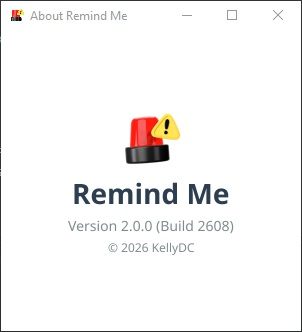

# Remind Me - Never Miss an Important Event

Remind Me is a lightweight Windows application that sends toast notifications for your scheduled tasks. It uses individual cron jobs for reliable, event-driven scheduling with a simple JSON configuration and user-friendly GUI editor.

**Version 2.0.0** | A Go language application for Windows task reminders

## Features

- **Flexible Scheduling**: Specific dates, daily tasks, weekday patterns (Monday,Wednesday,Friday), wildcards like \*:00 for hourly, and \*:15 for quarter-hourly
- **Toast Notifications**: Native Windows 10/11 notifications with custom icons and sounds
- **System Tray**: Right-click menu for easy access and control
- **GUI Editor**: Visual task editor with calendar and time pickers
- **Smart Sounds**: Automatic event detection on several occasions with per-task sound control
- **Auto-Generated IDs**: System-generated task IDs with timestamp + random string
- **Category Dropdown**: Predefined categories (General, Personal, Work, Special)
- **Special/Work/Personal**: Categories skip weekends automatically
- **Individual Cron Jobs**: Each task has dedicated scheduler for reliability
- **MSI Installer**: Professional Windows installer with auto-start

## Tech Stack

- Go 1.26
- WiX Toolset for MSI packaging (7.0)

## Installation

### Windows MSI Installer

1. Download `RemindMe-Setup.msi` from releases
2. Run the installer
3. Application auto-starts and adds itself to startup

### System Tray

Right-click the tray icon:

- **About Remind Me**: Open about window
- **Start with Windows**: Toggle auto-start
- **Edit Settings**: Open GUI editor
- **Quit**: Exit application

### GUI Settings Editor

### Features

- **Visual Task List**: See all tasks with name, category, time, and status
- **Easy Management**: Add, edit, delete tasks with intuitive forms
- **Date Picker**: Full calendar dialog with month navigation
- **Time Picker**: Dropdown time selector (hour and minute)
- **Category Dropdown**: Choose from General, Personal, Work, Special
- **Birthday Detection**: Tasks with "birthday" in name use birthday icon and birthday sound
- **Auto-Save**: Changes save immediately to settings.json

### Usage

1. Right-click system tray icon → **Edit Settings**
2. Select task from list to edit, or click **New Task**
3. Category dropdown: General, Personal, Work, or Special
4. Use date/time pickers for easy scheduling
5. Click **Save** - changes apply automatically
6. Event icons: birthday tasks show birthday icon, others shows default icon

### Task Form Fields

- **Name**: Display name (if contains "birthday", uses birthday icon/sound)
- **Category**: Dropdown selection (Work tasks skip weekends)
- **Description**: Notification message
- **Due Date**: Calendar picker (specific date, weekdays, or empty for daily)
- **Due Time**: Time picker (HH:MM format)
- **Sound**: Enable/disable sound per task
- **Enabled**: Enable/disable task

see [LICENSE](LICENSE) for details.
